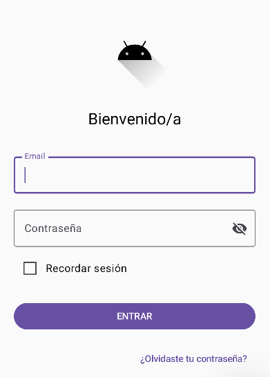
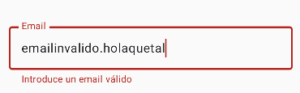
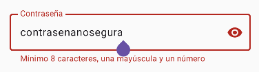
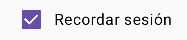

# Informe — Actividad 2.1 Inicio de Sesión

**Alumno/a:** Ernesto de Jesús Beltrán Marmolejos  
**Fecha:** 2 de octubre de 2026  
**Enlace al repositorio:** [Repositorio PMDM2627](https://github.com/edebm34/PMDM2627/tree/main/Login)

## Funcionalidad de las pantallas
> Si no se ven bien las capturas en el documento Markdown, están las imágenes en la carpeta `capturas`.
### Pantalla de Inicio de Sesión


### Email inválido


### Contraseña inválida


### Recordar sesión, FUNCIONANDO

#### Pasos para arreglarlo
1. Añadimos un flag mutable que indicará el estado de la checkbox.  
```kotlin
    var recordarSesión by remember { mutableStateOf(false) }
```
2. Sustituimos el valor _hardcodeado_ de la checkbox en el atributo _checked_.
```kotlin
    Checkbox(
                    checked = recordarSesión, // Antes era false y siempre estaba desmarcado...
                    onCheckedChange = {
                        recordarSesión = !recordarSesión // Con esto hacemos que la flag invierta su valor (si era true a false y viceversa).
                    }
                )
                Text(stringResource(R.string.recordar_sesion))
```
### Pantalla de Home/Inicio
> Si introducimos un email y contraseña válidos, la aplicación nos envía a Home, que se ve así:  


## Limpieza de cadenas _hardcodeadas_
La pantalla `LoginScreen` ya usaba `stringResource(R.string...)` en la mayoría de sus textos (logo, título, hints de email y contraseña, checkbox, botón y enlace de contraseña olvidada). Tras revisar el fichero, solo quedaban **dos textos _hardcodeados_**, ambos mensajes de error de validación:
 
- En `validarEmail()`: `"Introduce un email válido"`
- En `validarPassword()`: `"Mínimo 8 caracteres, una mayúscula y un número"`

La solución directa (poner `stringResource(R.string.xxx)` dentro de `validarEmail()` y `validarPassword()`) no compila. `stringResource` está anotada con `@Composable` (y `@ReadOnlyComposable`), por lo que solo puede llamarse desde otro contexto composable: una función `@Composable` o una lambda composable.

Las funciones `validarEmail()` y `validarPassword()` son funciones locales normales, no composables, así que no pueden resolver el recurso por sí mismas.

En lugar de guardar el texto del error en el estado, se guarda únicamente si hay error o no (boolean), y el texto se resuelve en la UI, que sí es un contexto composable.
 
### Cambio en el estado
 
Antes:
 
```kotlin
var emailError by remember { mutableStateOf<String?>(null) }
var passwordError by remember { mutableStateOf<String?>(null) }
```
 
Después:
 
```kotlin
var emailError by remember { mutableStateOf(false) }
var passwordError by remember { mutableStateOf(false) }
```
 
### Cambio en las funciones de validación
 
Antes:
 
```kotlin
emailError = if (!emailValido) "Introduce un email válido" else null
```
 
```kotlin
passwordError = if (!passValida) {
    "Mínimo 8 caracteres, una mayúscula y un número"
} else null
```
 
Después:
 
```kotlin
emailError = !emailValido
```
 
```kotlin
passwordError = !passValida
```
 
### Cambio en los campos de texto
 
Antes:
 
```kotlin
isError = emailError != null,
supportingText = emailError?.let { { Text(it) } },
```
 
Después (email):
 
```kotlin
isError = emailError,
supportingText = { if (emailError) Text(stringResource(R.string.error_email)) },
```
 
Después (contraseña):
 
```kotlin
isError = passwordError,
supportingText = { if (passwordError) Text(stringResource(R.string.error_password)) },
```

Aquí sí se puede usar `stringResource()` ya que es un contexto composable.

## Reto 1 — Cambiar alineación de `¿Olvidaste tu contraseña?`
Por defecto, el botón de `¿Olvidaste tu contraseña?` está centrado.  
Esto se debe a que el `Column()` que envuelve a los elementos tiene en su modifier `horizontalAlignment = Alignment.CenterHorizontally`. Pero lo podemos arreglar fácilmente: sobrescribiendo el modifier del propio botón para que no use el heredado de `Column()`.
```kotlin
TextButton(
            onClick = { /* Acción */ },
            modifier = Modifier.align(Alignment.End) // Al añadir esta línea sobrescribimos la alineación heredada de Column() y le decimos al botón que use Alignment.End
        ) {
            Text(stringResource(R.string.olvidaste_password))
        }
```